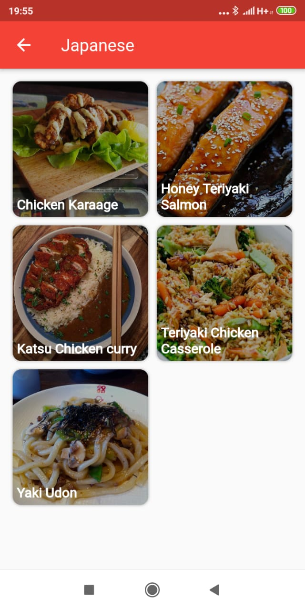

# Mr Stein's Recipe

APK : <a id="raw-url" href="https://github.com/mrstein21/meals_app/tree/master/apk">Download FILE</a>

HomePage :
 - Halaman yang menampilkan list category serta makanan resep italia serta pilihan untuk melihat makanan di negara lain  
  -----------------------------------------------------------------------------------------------------   
    

 
 
Search Page :
 - Halaman  yang berguna untuk melakukan pencarian masakan berdasarkan nama masakan   

Menu Area Page :
 - Halaman untuk melihat menu masakan berdasarkan area yang dipilih   

Menu Category Page :
 - Halaman untuk melihat menu masakan berdasarkan kategori yang dipilih   
 
Recipe Page :
 - Halaman untuk melihat bahan makanan dan instruksi dari masakan   
  -----------------------------------------------------------------------------------------------------   
 
 
About Page:
 - Halaman yang menampilkan biodata, deskripsi dan tujuan aplikasi, serta tools yang digunakan  
